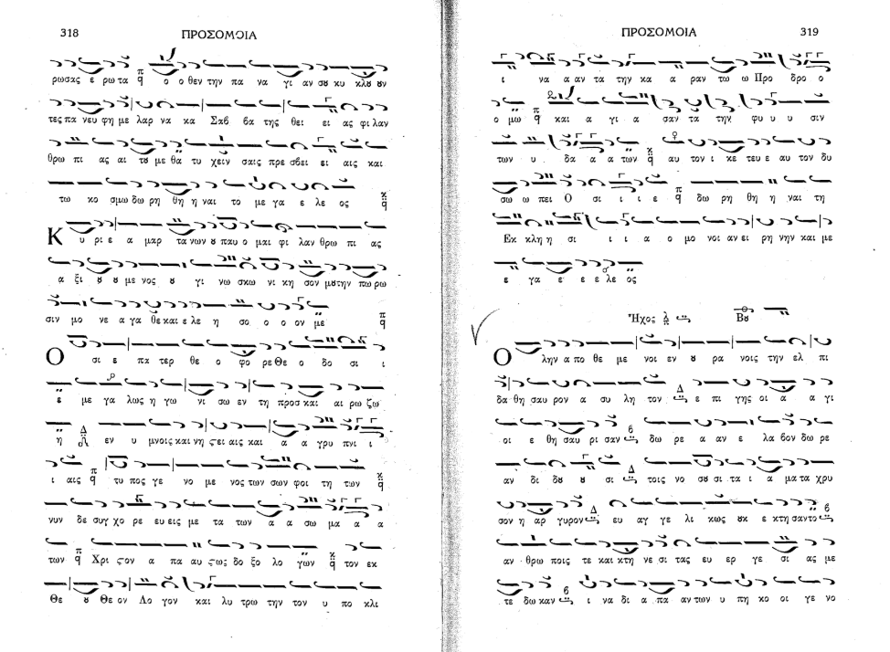
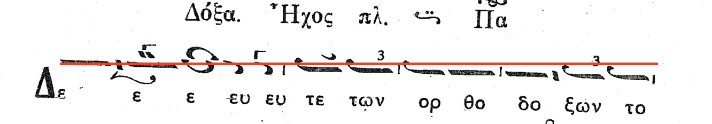
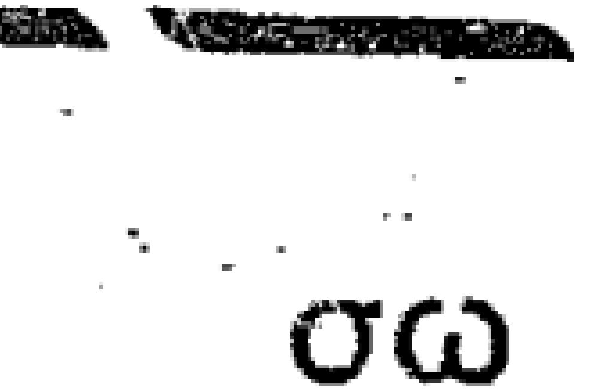
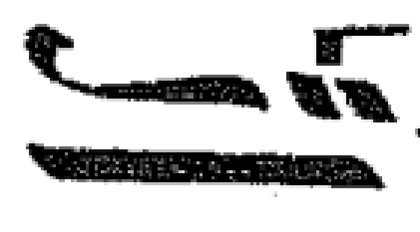

# Byzantine Chant OCR

This project is a toolset for performing optical character recognition (OCR) on Byzantine chant notation. It can process both PDFs and image files. Built in Python, the toolset uses OpenCV for image processing, PyTorch for deep learning, and a MobileNetV2 convolutional neural network (CNN) model for feature extraction and classification.

## How-to

### Download the app

Download the latest app version from the [Releases page](https://github.com/neanes/byzantine-chant-ocr/releases). Unzip the files to any directory.

### Run the app

Run the app and select a file to perform OCR on. For PDF files, input a page range. The table below explains the available settings. Select the options you want, then press `Go` and choose a location to save the file.

| Setting              | What It Does                                                                                                                                                                                                                                                                                                               | Example                                                      |
| -------------------- | -------------------------------------------------------------------------------------------------------------------------------------------------------------------------------------------------------------------------------------------------------------------------------------------------------------------------- | ------------------------------------------------------------ |
| **Two-Page Spread**  | Check this if your image (or PDF page) shows two pages side-by-side. The app will automatically split them before processing.                                                                                                                                                                                              |  |
| **Deskew**           | Straightens pages that are tilted. Even a small tilt—sometimes so small you can't see it—can confuse the OCR. Check this if the scan isn’t perfectly straight. The **max deg** parameter sets the maximum tilt angle the app will search for. Higher values correct larger tilts but increase processing time.             |           |
| **Despeckle**        | Check this if the image has lots of tiny black or white dots (“salt-and-pepper” noise). This applies a gentle smoothing filter. A larger **k-size** removes more dots but can slightly blur details.                                                                                                                       |        |
| **Close Holes**      | Check this if neumes look broken or have small gaps. This fills in tiny holes so the shapes are easier for the OCR to read. A larger **k-size** fills in more, but may slightly thicken shapes. If you’ve also enabled **Despeckle**, it’s a good idea to turn this on, since despeckling can sometimes create tiny holes. |      |
| **Use Latest Model** | When checked, the app automatically downloads the newest OCR model the first time you press **Go**. If a new model becomes available later, click **Check for Model Updates**. If unchecked, you'll need to choose the model files manually.                                                                               |                                                              |

> [!NOTE]
> Even small issues in your scan—like slight skew, tiny speckles, or small gaps in neumes—can have a surprisingly large impact on OCR accuracy. Applying the right settings can make a big difference, so don’t underestimate their effect.

### Import into Neanes

The resulting `.byzocr` file can be imported into [Neanes](https://github.com/neanes/neanes).

### The Neanes file is not as accurate as I would have hoped. What can I do?

It is generally expected that the OCR result will be at least 90% accurate for most common cases. You can use the martyria as a guide for finding and correcting errors. That is, if a martyria is not the expected value, then there must be an issue somewhere between the incorrect martyria and the last correct martyria.

If the resulting file is not sufficiently accurate, there are three possible causes.

1. The image or PDF file is not clear, or contains a severe tilt or non-linear distortions (e.g. a picture of a curved page).
2. There is a bug or inefficiency with the Neanes importer.
3. The model needs more training.

If the font used for the neumes is significantly different from [the fonts that the model was trained with](./SOURCES.md), then the results will be less accurate. If you want to help make the model better, see the [contribution guide](./CONTRIBUTING.md). The maintainers of this repository will likely priortize training the model on fonts that are the most common and that will impact the most users. But if you want to train on a more obscure font or on handwritten works, pull requests are welcome.

If the image contains a lot of extraneous text that is not part of the lyrics, but that is also close to the neumes, the text removal process may fail to remove this text before performing OCR. In this case, the text may be misinterpreted as neumes belonging to the closest baseline. You can manually remove the text yourself from the image and try again.

If the YAML output is accurate, but the Neanes file is not, then this is possibly and issue with the Neanes importer and should be reported as such.

## License

This project is licensed under the [GNU General Public License, version 3](./LICENSE).

## Acknowledgements

This project was inspired by and builds upon concepts from the following paper:

C. Dalitz, G.K. Michalakis, C. Pranzas: _[Optical Recognition of Psaltic Byzantine Chant Notation](https://lionel.kr.hs-niederrhein.de/~dalitz/data/publications/ijdar-psaltiki.pdf)_. International Journal of Document Analysis and Recognition, vol. 11, no. 3, pp. 143-158 (2008)
